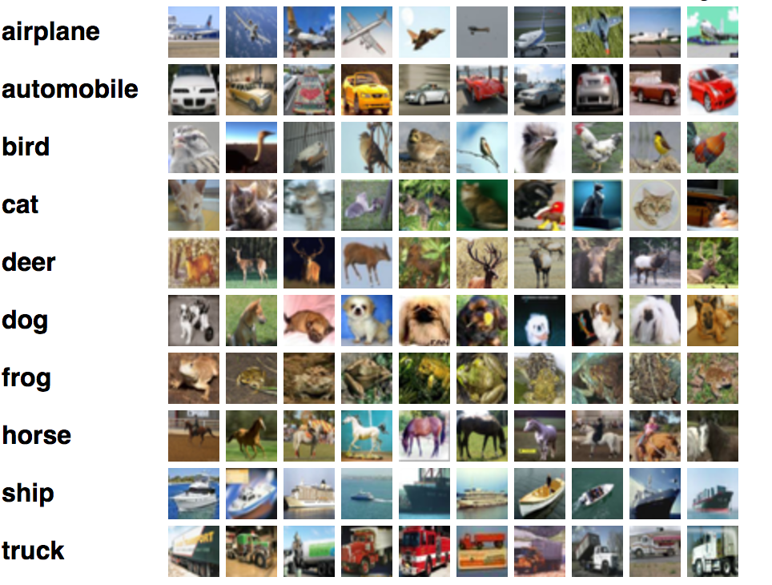

Classifier for CIFAR 10 Dataset
=
CIFAR 10 is a built-in dataset in keras which is widely for understanding the Convolutional Neural Network Arichtecture 
working with  3-color channel scheme (RGB) images. 
 
 The images are randomly aligned which belong to 10 different classes.
 
The classes and sample images of CIFAR 10 dataset are as follow:

