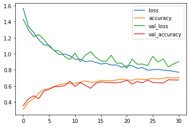
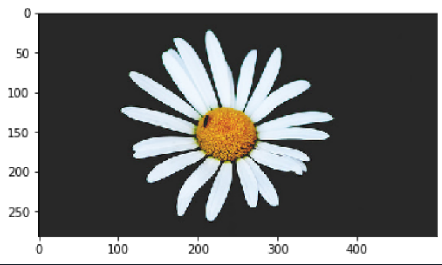
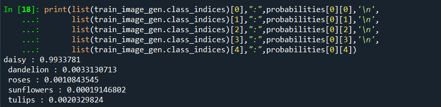

Flower Classifier using CNN
==================================================================

The Flower_Classifer.py file is a python code used for builing and training a CNN model
for classifying different flower images into 5 classes that are as follows:

Daisy - '0'

Danelion - '1'

Roses - '2'

Sunflowers - '3'

Tulips - '4'

You can load the model by downloading 'Flower_Classifier_model.h5' and use the 'load_model' class of tensorflow and directly start predicting classes for different flower images. 

The dataset for the model was taken from : https://goo.gl/EgJVXZ

The final results after training the model were as follows:

Data Augumentation was used in order to aviod overfitting. To learn more about data augumentation :

https://www.pyimagesearch.com/2019/07/08/keras-imagedatagenerator-and-data-augmentation/

After training the model a classification task was performed on a image from the test set of the data used for training.

The image was of a daisy flower (That we know but the model doesn't know) 

 

You can use any image !

After making the predcitions the model returned the class-wise probabilites as follows:

Looking at the probabilities the model predicts the highest probability for the class 'daisy' which is the correct answer.
